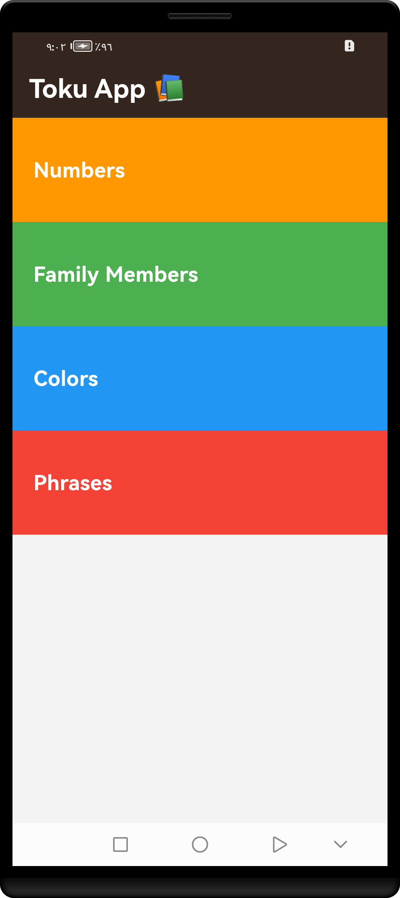
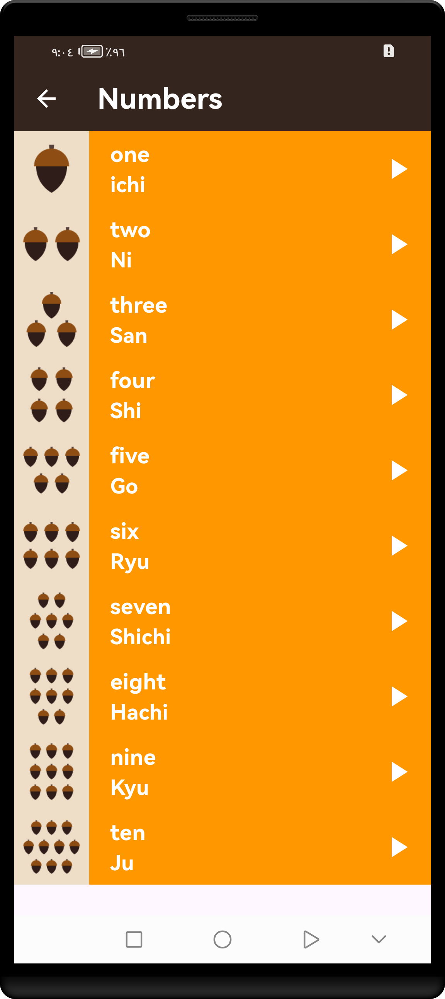
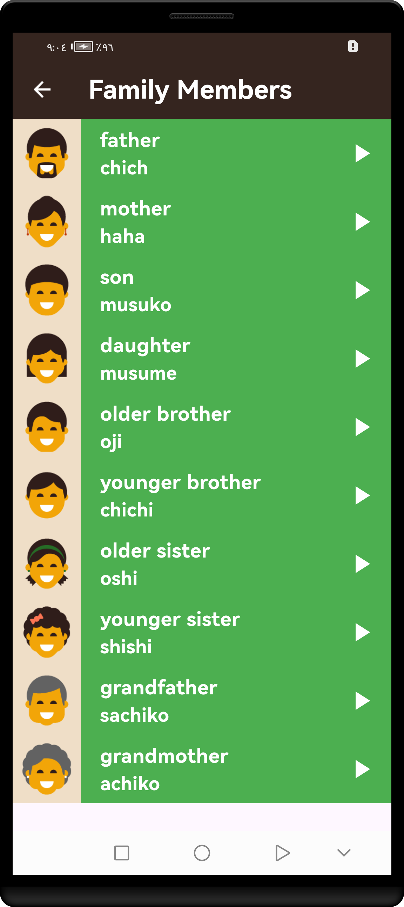
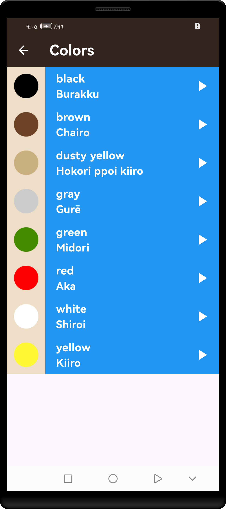
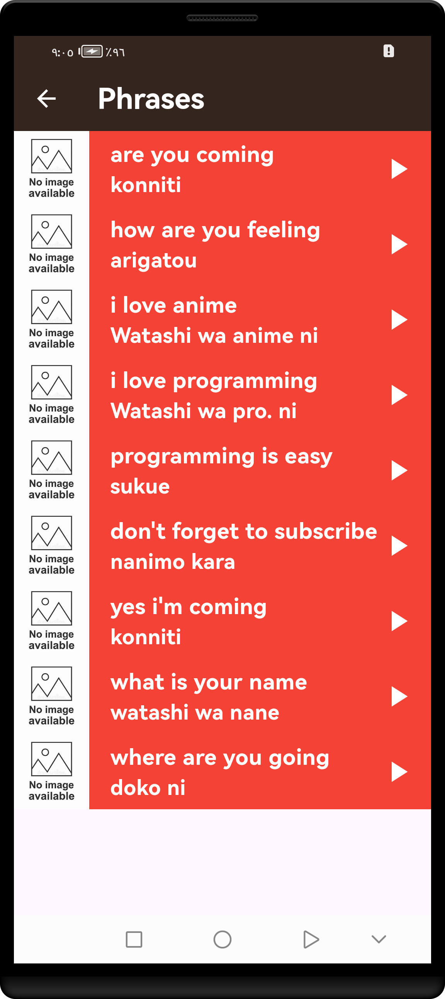

<br clear="both">
<a href="https://git.io/typing-svg"></a>
<br clear="both">

[](https://flutter.dev/)
[](https://opensource.org/licenses/MIT) 

Welcome to Toku App! This application is designed to help children learn Japanese from English in a fun and interactive way, focusing on four key fields: numbers, colors, phrases, and family members.

## Features

- **Interactive Lessons**: Engaging lessons specifically tailored for children to learn basic Japanese.  
- **vocabulary in colors**: phrases, numbers, and family members.
- **Audio Pronunciations**: Clear audio pronunciations by native speakers to help with correct pronunciation.
- **Visual Aids**: Colorful images and animations to make learning more appealing to children.

## Screenshots







## Getting Started

### How to Use

- **Numbers**: Learn how to count in Japanese. Engage with interactive counting games and quizzes to reinforce learning.

- **Family Members**: Learn the Japanese words for family members. Use visual aids to match words with images and practice pronunciation.

- **Colors**: Learn the names of different colors in Japanese. Interactive lessons will include visual aids and pronunciation guides.

- **Phrases**: Learn basic phrases used in everyday conversations. Repeat after native speakers and practice through fun activities.


## Prerequisites

Make sure you have Flutter installed. If not, you can [install Flutter](https://flutter.dev/docs/get-started/install) from the official website.

## Installation

1. Clone the repository from GitHub:
(`git clone https://github.com/mohamedmagdy2301/Toku-app.git`)

2. Navigate into the project directory:
(`cd toku_app`)

3. Get the dependencies:
 (`flutter pub get`)


## Usage

1. Connect your mobile device or start an emulator.
2. Run the application: (`flutter run`).
3. Use the app to add points to each team as needed during a basketball game.


## Contributing

Contributions are highly encouraged! If you would like to contribute to  `Toku App`, please follow these steps:

1. **Fork the Repository**.
2. **Create a New Branch**:
   ```bash
   git checkout -b feature/YourFeature
   ```
3. **Commit Your Changes**:
   ```bash
   git commit -m "Add your message"
   ```
4. **Push to the Branch**:
   ```bash
   git push origin feature/YourFeature
   ```
5. **Open a Pull Request**.

## Congratulations

You’ve successfully integrated `Toku App` into your Flutter app! For more advanced features and customization options.

If you found this guide helpful, don’t forget to ⭐ star this repository on GitHub to show your support!

Thank you for reading!
## License

This project is licensed under the MIT License - see the [LICENSE](LICENSE) file for details.

## Contact

For any questions or inquiries, feel free to reach out:

- **GitHub:** [mohamedmagdy2301](https://github.com/mohamedmagdy2301)
- **Email:** [mohammedmego15@gmail.com](mohammedmego15@gmail.com)

